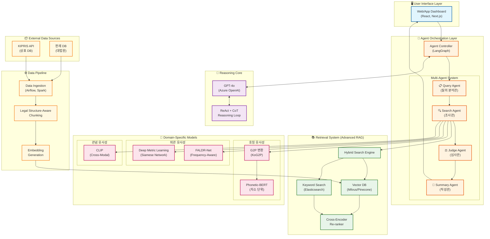
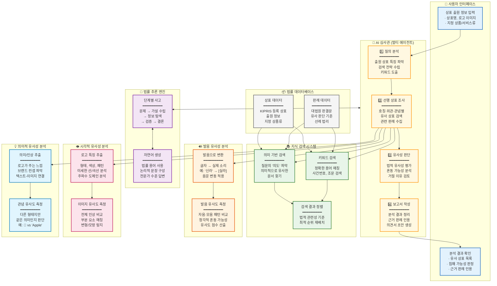
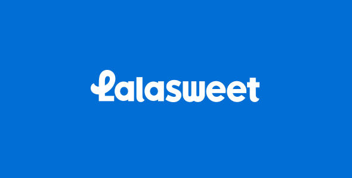
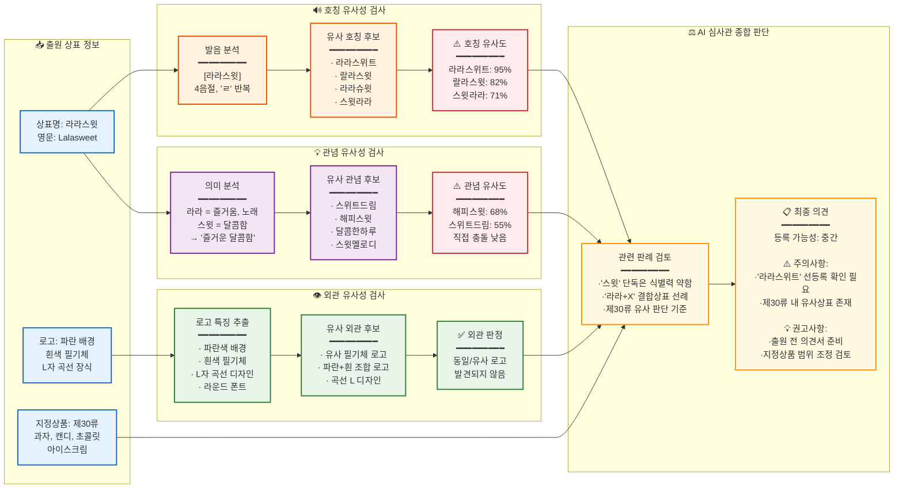

# **차세대 상표 선행 기술 조사 및 침해 분석을 위한 LLM 기반 Legal Tech 아키텍처 심층 연구 보고서**

## **1\. 서론 (Introduction)**

지식재산권(Intellectual Property, IP) 산업은 디지털 전환(Digital Transformation)의 가속화와 함께 급격한 변화의 시기를 맞이하고 있다. 특히 상표(Trademark) 분야는 전 세계적으로 출원 건수가 폭발적으로 증가함에 따라, 기존의 인력 중심 심사 및 검색 방식은 물리적 한계에 봉착했다. 한국 특허청(KIPO)의 통계에 따르면 상표 심사 처리 기간은 지속적으로 늘어나고 있으며, 이는 기업의 브랜드 전략 수립과 권리 확보에 불확실성을 가중시키는 요인으로 작용하고 있다. 더불어 상표 침해 양상은 단순한 도용을 넘어, 교묘한 변형(Modification)이나 이종 상품 간의 브랜드 희석(Dilution) 등 고도화된 형태로 진화하고 있어, 전통적인 키워드 매칭이나 단순 이미지 매칭 알고리즘으로는 탐지하기 어려운 영역이 확대되고 있다.

본 연구 보고서는 이러한 난제를 해결하기 위해 대형언어모델(Large Language Models, LLM), 특히 GPT-4o와 같은 최신 멀티모달(Multi-modal) 모델을 활용한 **'차세대 상표 선행 조사 및 침해 분석(Next-Generation Trademark Prior Art Search and Infringement Analysis)'** 솔루션의 기술적 아키텍처를 제안하고 검증하는 것을 목적으로 한다. 본 연구는 단순히 LLM을 적용하는 것을 넘어, 법률 도메인 특유의 엄밀성과 한국 상표법(Korean Trademark Law)의 특수성—외관(Appearance), 호칭(Pronunciation), 관념(Conception)의 3요소—을 만족시키기 위한 최적의 방법론을 탐구한다. 특히, 모델의 전체 파라미터를 재학습시키는 파인튜닝(Fine-tuning) 방식의 한계를 지적하고, 이를 대체할 수 있는 **검색 증강 생성(Retrieval-Augmented Generation, RAG)** 및 **에이전트 워크플로우(Agentic Workflow)** 중심의 아키텍처가 왜 현대 Legal Tech의 표준(Standard)이 되어야 하는지를 기술적, 경제적 관점에서 심층 분석한다.

본 보고서는 2023년부터 2026년 초까지 발표된 컴퓨터 비전(Computer Vision), 자연어 처리(NLP), 법률 인공지능(Legal AI) 분야의 최신 연구 논문(SOTA Research)과 벤치마크 데이터를 기반으로 작성되었으며, 제안된 아키텍처가 실제 산업 현장에서 구현 가능함을 입증하는 타당성 분석을 포함한다.

## ---

**2\. 법률 추론 아키텍처: RAG 대 파인튜닝의 기술적 타당성 분석 (Legal Reasoning Architecture)**

상표 침해 분석 시스템의 핵심 엔진은 법적 논리를 구성하고, 유사성 판단의 근거를 추론(Reasoning)하는 능력이다. 이를 구현하기 위한 방법론으로 거대 모델 자체를 특정 법률 데이터로 재학습시키는 파인튜닝(Fine-tuning)과, 모델은 동결(Frozen)한 채 외부 지식 베이스를 참조하게 하는 RAG(Retrieval-Augmented Generation) 방식이 대립해 왔다. 최신 연구 결과들은 법률 도메인의 특수성, 즉 데이터의 최신성(Recency)과 사실적 정확성(Factual Accuracy) 요구사항을 고려할 때 RAG 아키텍처가 우월함을 시사하고 있다.

### **2.1 파인튜닝(Fine-tuning)의 구조적 한계와 법률 도메인 부적합성**

파인튜닝은 사전 학습된 모델(Pre-trained Model)에 특정 도메인의 데이터셋을 추가 학습시켜 가중치(Weights)를 조정하는 방식이다. 이는 모델의 내재적 지식(Parametric Memory)을 확장하는 데 기여할 수 있으나, 상표법과 같이 역동적인 법률 환경에서는 치명적인 구조적 한계를 드러낸다.

#### **2.1.1 지식의 정적성과 업데이트 비용 (Static Knowledge & Update Cost)**

법률은 살아있는 유기체와 같다. 한국 특허청의 심사 기준(Examination Guidelines)은 수시로 개정되며, 대법원 판례(Supreme Court Precedents)는 매일 새롭게 생성되어 기존 법리를 뒤집거나 구체화한다. [1](https://jolt.law.harvard.edu/digest/retrieval-augmented-generation-rag-towards-a-promising-llm-architecture-for-legal-work)의 분석에 따르면, LLM의 파라메트릭 메모리는 학습 시점의 데이터에 고정되어 있어, '어제' 내려진 판결이나 '오늘' 변경된 심사 지침을 반영하지 못한다. 이를 해결하기 위해 매번 모델을 재학습(Retraining)하는 것은 막대한 연산 자원과 비용을 소모하며, 서비스의 지속 가능성을 저해한다. [2](https://www.oracle.com/artificial-intelligence/generative-ai/retrieval-augmented-generation-rag/rag-fine-tuning/)은 파인튜닝이 초기 구축 비용뿐만 아니라 유지보수 관점에서 비효율적임을 지적한다. 상표 데이터베이스(KIPRIS)가 실시간으로 갱신되는 환경에서, 정적인 모델은 필연적으로 "구식 법률 전문가"가 될 수밖에 없다.

#### **2.1.2 환각(Hallucination)과 법적 인용의 오류**

법률 서비스에서 가장 경계해야 할 것은 '그럴듯한 거짓말', 즉 환각이다. [3](https://hai.stanford.edu/news/ai-trial-legal-models-hallucinate-1-out-6-or-more-benchmarking-queries)와 [4](https://dho.stanford.edu/wp-content/uploads/Legal_RAG_Hallucinations.pdf)의 스탠포드 대학교 연구팀(2025)이 수행한 벤치마크에 따르면, 법률 특화 파인튜닝을 거친 모델이라 할지라도 법적 쿼리에 대해 17%에서 33%의 환각률을 보였다. 특히 존재하지 않는 판례를 생성하거나, 실제 판례의 결론을 반대로 해석하는 '사실적 부정(Factual Infidelity)' 오류가 빈번했다.[5](https://academic.oup.com/jla/article/16/1/64/7699227) 이는 LLM이 확률론적 텍스트 생성기이기 때문에 발생하는 근본적인 문제로, 파인튜닝만으로는 완전히 제어할 수 없다. [6](https://arxiv.org/abs/2412.06272)의 연구 또한 호주 법률 인용 벤치마크(AusLaw Citation Benchmark)에서 파인튜닝 모델이 독립적으로는 낮은 성능을 보였음을 확인하였다.

### **2.2 RAG(Retrieval-Augmented Generation)의 기술적 우위 및 진화**

RAG는 모델의 파라미터를 수정하지 않고, 벡터 데이터베이스(Vector Database)와 검색 엔진을 통해 외부의 신뢰할 수 있는 데이터(Source of Truth)를 프롬프트에 주입(Injection)하는 방식이다. 이는 법률 도메인의 요구사항인 정확성, 최신성, 설명 가능성을 충족시키는 데 최적화된 아키텍처이다.

#### **2.2.1 동적 지식 통합과 실시간성 (Dynamic Knowledge Integration)**

RAG 아키텍처 하에서 시스템은 KIPRIS API나 판례 데이터베이스와 실시간으로 연동된다. 새로운 상표가 출원되거나 새로운 판례가 등록되면, 이는 즉시 벡터 인덱스(Vector Index)에 반영되어 검색 가능해진다. 모델은 추론 시점에 가장 최신의 정보를 조회(Retrieve)하여 답변을 생성하므로, 지식의 시차(Time Lag)가 발생하지 않는다. [7](https://arxiv.org/html/2501.18365v1)과 [8](https://arxiv.org/html/2508.00709v2)는 RAG가 외부 지식 소스를 통합함으로써 사실적 정확성을 강화하고 최신 정보 접근성을 보장하는 핵심 기술임을 강조한다.

#### **2.2.2 설명 가능성(Explainability)과 근거 기반 추론**

상표 심사 및 침해 분석 보고서는 반드시 판단의 '근거'를 명시해야 한다. "왜 이 상표가 유사한가?"라는 질문에 대해 RAG 시스템은 생성된 답변이 참조한 구체적인 문서(예: 대법원 2023후1234 판결문, 제3쪽)를 하이라이트하거나 인용할 수 있다. 이는 블랙박스(Black-box) 모델인 파인튜닝 방식이 제공하기 어려운 투명성을 보장한다. [1](https://jolt.law.harvard.edu/digest/retrieval-augmented-generation-rag-towards-a-promising-llm-architecture-for-legal-work)은 RAG가 외부 소스를 '비파라메트릭 메모리(Non-parametric Memory)'로 활용함으로써 환각을 줄이고 신뢰할 수 있는 인용을 가능하게 한다고 설명한다.

| 비교 항목 | 파인튜닝 (Fine-tuning) | RAG (Retrieval-Augmented Generation) | 비고 |
| :---- | :---- | :---- | :---- |
| **지식 최신성** | 학습 시점 고정 (정적) | 실시간 업데이트 반영 (동적) | 법률 개정 대응 필수 |
| **환각 위험** | 높음 (17\~33% 이상) | 낮음 (근거 기반 생성으로 억제) | [4](https://dho.stanford.edu/wp-content/uploads/Legal_RAG_Hallucinations.pdf) 참조 |
| **설명 가능성** | 낮음 (내부 가중치 의존) | 높음 (참조 문서 명시 가능) | 법적 신뢰성 핵심 |
| **비용 구조** | 고비용 (학습 및 GPU 자원) | 저비용 (검색 인프라 중심) | [9](https://platform.openai.com/docs/pricing) 참조 |
| **데이터 보안** | 모델에 데이터 내재화 (유출 위험) | 데이터와 모델 분리 (접근 제어 용이) | [2](https://www.oracle.com/artificial-intelligence/generative-ai/retrieval-augmented-generation-rag/rag-fine-tuning/) 참조 |

### **2.3 Advanced RAG 전략: 법률 도메인 특화 아키텍처**

단순한 RAG(Naive RAG) 또한 검색 실패나 문맥 누락의 문제가 발생할 수 있다. 따라서 본 솔루션은 법률적 정밀도를 극대화하기 위해 다음과 같은 **Advanced RAG** 패턴을 채택해야 한다.

#### **2.3.1 법적 구조 기반 청킹 (Legal Structure-Aware Chunking)**

일반적인 텍스트 청킹(Fixed-size Chunking)은 법률 문서의 논리적 흐름을 단절시킬 수 있다. 판결문은 '주문', '청구 취지', '이유' 등으로 명확히 구조화되어 있다. 데이터 전처리 단계에서 이러한 구조를 파싱(Parsing)하여, 각 청크가 법적 의미 단위(Semantic Unit)를 유지하도록 해야 한다. 예를 들어, "상표의 유사 여부 판단"이라는 섹션을 하나의 청크로 보존하고, 해당 청크에 메타데이터(법원명, 선고일, 사건 번호 등)를 풍부하게 태깅하여 검색의 정확도를 높인다.

#### **2.3.2 하이브리드 검색 (Hybrid Search) 및 재순위화 (Re-ranking)**

벡터 유사도(Vector Similarity) 검색은 의미적 연관성을 찾는 데 유리하지만, 정확한 법률 용어나 사건 번호 매칭(Keyword Matching)에는 약할 수 있다. 따라서 **BM25**와 같은 키워드 검색 알고리즘과 **Dense Retrieval**을 결합한 하이브리드 검색을 수행해야 한다. 1차 검색된 후보군에 대해 **Cross-Encoder** 기반의 Re-ranker를 적용하여, 질의와 문서 간의 법적 논리적 연관성을 다시 정밀하게 평가한다. [6](https://arxiv.org/abs/2412.06272)의 연구는 이러한 하이브리드 전략과 Re-ranking 단계가 법률 정보 검색의 성능을 비약적으로 향상시킴을 입증하였다.

#### **2.3.3 질의 확장 (Query Expansion) 및 가상의 문서 임베딩 (HyDE)**

사용자의 짧은 질문(예: "스타벅스 유사 상표 검색")만으로는 충분한 법적 맥락을 확보하기 어렵다. LLM을 이용하여 질의를 확장하거나, **HyDE (Hypothetical Document Embeddings)** 기법을 통해 "이 질문에 대한 이상적인 판결문 요지"를 가상으로 생성한 후 이를 임베딩하여 검색하는 방식을 도입한다. 이는 검색 엔진이 단순 키워드가 아닌 '답변의 논리적 형태'와 유사한 문서를 찾도록 유도한다.

## ---

**3\. 상표 유사성 평가 아키텍처 1: 호칭 (Trademark Similarity Assessment: Phonetic)**

상표의 유사성 판단에 있어 \*\*호칭(Pronunciation)\*\*은 가장 직관적이면서도 강력한 요소이다. 특히 한국어(Hangul)는 표음 문자로서 자음과 모음의 조합으로 수만 가지의 소리를 표현할 수 있으며, 연음, 자음동화, 구개음화 등 복잡한 음운 변동 규칙을 가지고 있다. 따라서 텍스트의 표기(Spelling)가 다르더라도 발음이 유사하여 수요자의 혼동을 유발하는 '청각적 유사 상표(Sound-alikes)'를 식별하는 것이 기술적 난제이다.

### **3.1 한국어 음운론적 특성과 G2P (Grapheme-to-Phoneme) 기술**

"설빙(Sulbing)"과 "설리빙(Sulibing)" ([10](https://koreajoongangdaily.joins.com/news/2025-04-14/business/economy/Sulbing-case-highlights-worsening-trademark-squatting-involving-Korean-companies/2284934)), "스타벅스(Starbucks)"와 "스타프레야(Starpreya)" ([12](https://www.managingip.com/article/2a5bqo2drurt0bxatq1uv/starbucks-loses-to-korean-name-rival))와 같은 실제 분쟁 사례는 미세한 발음 차이가 법적 분쟁의 핵심이 됨을 보여준다. 텍스트 편집 거리(Levenshtein Distance) 알고리즘은 이러한 음성적 유사성을 포착하는 데 한계가 있다.

이를 해결하기 위해 본 아키텍처는 **G2P (Grapheme-to-Phoneme)** 변환 기술을 전처리 파이프라인의 핵심으로 배치한다. [14](https://pypi.org/project/g2pK/)의 KoG2P와 같은 라이브러리는 한국어 텍스트를 실제 발음되는 소리 기호로 변환한다.

* **음운 변동 반영:** "신라" → \[실라\] (유음화), "같이" → \[가치\] (구개음화), "국물" → \[궁물\] (비음화)  
* **영문 상표의 한글 발음화:** 영문으로 표기된 상표(예: "NIKE") 또한 한국어 표준 발음(예: "나이키")으로 변환하여([15](https://jip.or.kr/2001-03/)), 영문 상표와 한글 상표 간의 교차 유사성 분석을 가능하게 한다. [16](https://www.mdpi.com/2076-3417/11/6/2866)의 연구는 다국어 혼합 환경에서의 음성 변환 모델링의 중요성을 강조한다.

### **3.2 딥러닝 기반 음성 유사성 알고리즘: Phonetic-BERT**

단순한 G2P 변환 후 문자열 비교를 넘어, 딥러닝을 통해 발음의 '유사도 벡터'를 학습하는 접근이 필요하다. [17](https://www.semanticscholar.org/paper/2-gram-based-Phonetic-Feature-Generation-for-Neural-Ko-Lee/f4bd317532a24ef2b4a0d9502ecf0a84d785684d)와 [18](https://arxiv.org/pdf/1802.03581)은 CNN을 활용한 2D 음성 특징 맵 생성을 제안했으나, 본 리포트에서는 최신 트랜스포머(Transformer) 기술을 접목한 **Phonetic-BERT** 아키텍처를 제안한다.

#### **3.2.1 모델 아키텍처 및 학습 전략**

* **입력 표상(Input Representation):** 한국어의 음절(Syllable) 단위 토큰화는 발음의 미세한 구성 요소를 놓칠 수 있다. 따라서 [19](https://github.com/snunlp/KR-BERT)의 KR-BERT (Sub-character/Grapheme level) 모델을 기반으로, 자소(Jamo) 단위 또는 음소(Phoneme) 단위로 토큰화된 입력을 처리한다. 이는 초성, 중성, 종성의 결합 관계를 모델이 이해하게 한다.  
* **대조 학습 (Contrastive Learning):** 대법원 판례에서 '호칭이 유사하다'고 판결된 상표 쌍(Positive Pairs)과 '비유사하다'고 판결된 쌍(Negative Pairs)을 학습 데이터셋으로 구축한다. 샴 네트워크(Siamese Network) 구조 하에서, 유사한 상표 쌍의 임베딩 거리는 좁히고 비유사한 쌍의 거리는 멀어지도록 **Contrastive Loss** (예: InfoNCE)를 최적화한다.

#### **3.2.2 알고리즘 워크플로우**

1. **입력:** 출원 상표(Query)와 선행 상표(Target).  
2. **전처리 (G2P):** 두 상표를 모두 표준 발음열로 변환 (음운 변동 적용).  
3. **임베딩 (Phonetic Encoder):** Phonetic-BERT를 통과시켜 고차원 음성 벡터(Phonetic Vector) 생성.  
4. **유사도 산출:** 두 벡터 간의 코사인 유사도(Cosine Similarity) 계산.  
5. **판단:** 법적 임계값(Threshold)을 기준으로 유사 여부 판정 및 유사도 점수 반환.

이 접근 방식은 [20](https://scholarworks.iu.edu/journals/index.php/iulcwp/article/view/26037)에서 지적한 "법적으로 객관적인 음성 유사성 기준의 부재"를 데이터 기반의 확률적 모델로 보완하며, 심사관에게 정량적인 근거를 제시할 수 있다.

## ---

**4\. 상표 유사성 평가 아키텍처 2: 외관 및 관념 (Trademark Similarity Assessment: Visual & Conceptual)**

상표의 \*\*외관(Appearance)\*\*과 \*\*관념(Conception)\*\*은 텍스트나 발음만으로는 포착할 수 없는 시각적, 의미적 요소를 포함한다. 로고(Logo)의 도형적 유사성이나, 전혀 다른 형태지만 동일한 의미를 지닌 상표(예: '사과' 그림과 'Apple' 텍스트)를 식별하기 위해서는 최신 컴퓨터 비전(Computer Vision) 기술과 멀티모달 학습이 필수적이다.

### **4.1 시각적 유사성(Visual Similarity): FALDR-Net 및 딥 메트릭 러닝**

2024년과 2025년 컴퓨터 비전 분야, 특히 로고 탐지(Logo Detection) 분야에서는 획기적인 발전이 있었다. 본 솔루션은 최신 SOTA(State-of-the-Art) 모델인 **FALDR-Net**을 핵심 시각 엔진으로 채택한다.

#### **4.1.1 FALDR-Net (Frequency-Aware Learnable Dual Reweighting Network)**

IEEE TPAMI 2025에 게재된 FALDR-Net [21](https://pubmed.ncbi.nlm.nih.gov/41201941/)은 대규모 로고 탐지에서의 클래스 불균형과 미세한 특징 학습 문제를 해결하기 위해 제안되었다.

* **주파수 인식 학습 (Frequency-Aware Learning):** 로고 이미지를 푸리에 변환(Fourier Transform) 등을 통해 주파수 도메인으로 변환한다. 인간의 시각은 저주파(전반적인 형태, 색상)에 민감하지만, 상표의 구체적 식별점은 고주파(에지, 텍스처, 미세 패턴)에 존재한다. [22](https://www.mdpi.com/2079-9292/14/18/3690)의 연구들은 주파수 도메인 정보를 활용하여 로고의 미세한 변형(Modification)이나 교묘한 모방을 효과적으로 탐지할 수 있음을 입증했다.  
* **이중 재가중치(Dual Reweighting):** 수백만 개의 상표 중에는 빈번하게 등장하는 유명 상표와 희귀한 상표가 혼재한다. FALDR-Net은 학습 빈도에 따라 가중치를 동적으로 조절하여, 데이터가 적은 롱테일(Long-tail) 상표에 대해서도 높은 검출력을 유지한다.

#### **4.1.2 벤치마크 및 데이터셋: OpenLogo**

모델의 성능 검증을 위해 **OpenLogo Benchmark** ([24](https://www.researchgate.net/publication/326222984_Open_Logo_Detection_Challenge))를 활용한다. OpenLogo는 27,000개 이상의 이미지와 352개 클래스를 포함하며, 특히 학습에 포함되지 않은 새로운 로고가 등장하는 **Open-Set** 환경을 가정한다. 이는 매일 새로운 상표가 출원되는 실제 특허청 심사 환경과 가장 유사한 테스트베드이다. 본 솔루션은 OpenLogo 벤치마크 상위권 모델의 아키텍처를 기반으로 한국 상표 데이터셋(K-Logo Dataset)에 적응(Adaptation)시켜야 한다.

### **4.2 관념적 유사성(Conceptual Similarity): CLIP 기반 멀티모달 검색**

상표법상 '관념'의 유사성은 두 상표가 대중에게 심어주는 의미나 인상이 유사한 경우를 말한다. 이는 텍스트와 이미지를 상호 연결하는 멀티모달 추론 능력을 요구한다.

#### **4.2.1 CLIP (Contrastive Language-Image Pre-training) 활용**

OpenAI의 CLIP이나 그 변형 모델들은 텍스트와 이미지를 동일한 벡터 공간(Embedding Space)에 매핑한다.

* **교차 모달 검색 (Cross-Modal Retrieval):** 사용자가 "왕관을 쓴 사자"라고 텍스트로 검색하면, 시스템은 실제 '왕관 쓴 사자' 그림이 포함된 로고를 검색한다. 반대로, 로고 이미지를 입력하면 그 로고가 의미하는 텍스트 키워드(예: "왕관", "사자", "권위")를 추출할 수 있다.  
* **의미적 유사성 판단:** 시각적으로는 전혀 다른 두 로고(예: 실사 사자 사진 vs. 추상화된 사자 그림)라도, 벡터 공간상에서 가까운 위치에 존재한다면 관념적으로 유사하다고 판단할 수 있다. 이는 상표의 '모티브' 도용을 탐지하는 데 강력한 도구가 된다.

### **4.3 계층적 검색 아키텍처 (Hierarchical Retrieval Architecture)**

수백만 건의 상표 DB를 대상으로 GPT-4o Vision 기능을 직접 수행하는 것은 비용적으로 불가능하다. 따라서 효율적인 **계층적(Hierarchical) 검색 구조**를 설계한다.

1. **1차 검색 (Coarse Retrieval):** 경량화된 Deep Metric Learning 모델(Siamese Network, ResNet-50 backbone)과 CLIP 임베딩을 사용하여, 전체 DB에서 유사도 상위 N개(예: 100개) 후보군을 고속으로 추출한다. 이때 [27](https://www.researchgate.net/publication/352344904_Deep_Metric_Learning_for_Image_Retrieval_in_Smart_City_Development)의 Proxy-Anchor Loss 등을 활용하여 검색 속도와 정확도를 최적화한다.  
2. **2차 검증 (Fine-grained Verification):** 추출된 후보군에 대해 FALDR-Net을 적용하여 정밀한 시각적 특징 비교를 수행하거나, GPT-4o Vision을 호출하여 복잡한 관념적 유사성에 대한 상세한 자연어 분석을 수행한다.

## ---

**5\. 심사관 모방 에이전트 워크플로우 (Agentic Workflow for Adjudication)**

단순한 유사도 점수 나열은 법률 전문가에게 충분한 가치를 제공하지 못한다. 본 솔루션은 실제 심사관처럼 사고(Think)하고, 필요한 정보를 탐색(Act)하며, 최종적으로 판단(Decide)을 내리는 **자율 에이전트(Autonomous Agent)** 시스템을 지향한다. 이는 2025년 Legal Tech의 핵심 트렌드인 \*\*'Agentic Workflow'\*\*를 반영한 것이다 ([28](https://legal.thomsonreuters.com/blog/agentic-workflows-for-legal-professionals-a-smarter-way-to-work-with-ai/)).

### **5.1 L-MARS 및 LAW 프레임워크 기반 설계**

최신 연구인 **L-MARS (Legal Multi-Agent Workflow)** [29](https://arxiv.org/html/2509.00761v2)와 **LAW (Legal Agentic Workflow)** [30](https://aclanthology.org/2025.coling-industry.50.pdf)는 법률 에이전트 설계의 청사진을 제공한다. 이들은 단일 LLM에 의존하는 대신, 전문화된 역할을 가진 여러 에이전트가 협업(Orchestration)하는 구조를 채택한다.

#### **5.1.1 멀티 에이전트 역할 정의 (Role Definition)**

1. **Query Agent (질의 분석관):** 사용자의 출원 상표 정보를 분석하여 핵심 특징(Key Features), 지정 상품(Nice Classification), 식별력 유무 등을 파악하고 검색 전략(Search Plan)을 수립한다.  
2. **Search Agent (조사관):** 수립된 전략에 따라 도구(Tools)를 사용하여 선행 상표를 수집한다. 텍스트 검색(KIPRIS API), 호칭 검색(Phonetic-BERT), 외관 검색(FALDR-Net), 판례 검색(Legal RAG) 등 다양한 하위 도구를 호출한다.  
3. **Judge Agent (심사관):** 수집된 증거(Evidence)와 출원 상표를 대조하여 유사성 여부를 판단한다. 유사도 점수뿐만 아니라, 법적 논리(Legal Rationale)를 구성하고, 상표법 제34조 제1항 각 호의 거절 이유 해당 여부를 검토한다.  
4. **Summary Agent (작성관):** 심사관의 판단을 바탕으로 최종 보고서(Report)나 의견제출통지서(Office Action) 초안을 작성한다.

### **5.2 ReAct (Reasoning \+ Acting) 및 CoT (Chain-of-Thought) 구현**

심사관 에이전트는 **ReAct** 패턴을 통해 논리적 사고의 흐름을 전개한다. 다음은 '스타프레야' 상표 심사 시나리오의 예시이다.

1. **Thought (사고):** "출원 상표 '스타프레야'와 선행 상표 '스타벅스'가 유사한지 판단해야 해. 먼저 지정 상품이 동일한지 확인하자."  
2. **Action (행동):** CheckGoodsSimilarity('스타프레야', '스타벅스') 호출.  
3. **Observation (관찰):** "두 상표 모두 커피 및 음료(제30류, 제43류)로 지정 상품이 동일/유사함."  
4. **Thought:** "상품이 유사하므로 표장의 유사성을 판단해야 해. 먼저 호칭 유사성을 보자."  
5. **Action:** PhoneticSimilarity('스타프레야', '스타벅스') 호출.  
6. **Observation:** "호칭 유사도 0.4 (낮음). '벅스'와 '프레야'의 발음 차이가 큼."  
7. **Thought:** "호칭은 비유사해. 하지만 로고의 외관이 매우 비슷하다는 정보가 있어. 시각적 유사성을 확인하고, 이와 관련된 판례가 있는지 찾아보자."  
8. **Action:** VisualSimilarity(Logo\_A, Logo\_B) 및 LegalCaseSearch('원형 녹색 로고 인물 형상 유사성 판례') 호출.  
9. **Observation:** "외관 유사도 0.85 (높음). 관련 판례(대법원 사건)에서 외관의 지배적 인상이 유사하면 혼동 가능성을 인정한 사례 발견."  
10. **Final Conclusion (결론):** "호칭은 다르나, 외관 및 관념의 유사성과 지정 상품의 동일성으로 인해 일반 수요자의 혼동을 초래할 우려가 있음. 상표법 제34조 제1항 제7호에 해당하여 등록 거절될 가능성 높음."

이 과정에서 GPT-4o는 각 단계의 '두뇌' 역할을 하며 [32](https://arxiv.org/html/2503.06580v1)에서 언급된 바와 같이 복잡한 법적 문제 해결을 위한 장기적인 계획(Planning)과 도구 조작(Tool Manipulation) 능력을 발휘한다.

## ---

**6\. 시스템 아키텍처 및 타당성 (System Architecture & Feasibility)**

### **6.1 전체 시스템 아키텍처 개요**

본 솔루션은 유연성과 확장성을 보장하기 위해 \*\*마이크로서비스 아키텍처(Microservices Architecture, MSA)\*\*를 채택한다.

| 계층 (Layer) | 구성 요소 (Component) | 기술 스택 (Tech Stack) | 역할 및 기능 |
| :---- | :---- | :---- | :---- |
| **User Interface** | Web/App Dashboard | React, Next.js | 사용자 질의 입력, 분석 결과 시각화, 보고서 다운로드 |
| **Agent Orchestration** | **Agent Controller** | **LangGraph**, Python | 에이전트 간 협업 제어, 상태 관리(State Management), ReAct 루프 실행 |
| **Reasoning Core** | LLM Engine | **GPT-4o (Azure OpenAI)** | 법률 추론, 자연어 생성, 에이전트 두뇌 역할 (API 호출) |
| **Retrieval System** | Search Engine | **Milvus** / Pinecone, Elasticsearch | 벡터 유사도 검색(Vector Search), 키워드 검색, 하이브리드 검색 |
| **Domain Models** | AI Models (Custom) | **Phonetic-BERT**, **FALDR-Net**, CLIP | 호칭/외관/관념 유사도 계산을 위한 특화 모델 서빙 (Inference) |
| **Data Pipeline** | Data Ingestion | Apache Airflow, Spark | KIPRIS 데이터 수집, 정제, 법적 구조 기반 청킹, 임베딩 생성 |
| **Infrastructure** | Cloud Platform | AWS / Azure (Korea Region) | 컴퓨팅 자원 관리, 오토스케일링, 보안 그룹 설정 |

#### **알고리즘 중심 시스템 아키텍처 다이어그램**

#### **개념 중심 시스템 아키텍처 다이어그램**

> 아래 다이어그램은 알고리즘 명칭 대신 **각 컴포넌트가 수행하는 역할**을 쉬운 키워드로 설명합니다.

#### **실제 예시: "라라스윗" 상표 출원 분석 흐름**

> 아래 다이어그램은 "라라스윗(Lalasweet)" 상표 출원 시 AI 시스템이 수행하는 **실제 분석 흐름**을 보여줍니다.

**출원 상표 이미지:**

### **6.2 오프더셸프(Off-the-shelf) API vs. 자체 개발(Custom) 타당성 분석**

#### **6.2.1 LLM 추론 엔진: GPT-4o API 활용 (Buy Strategy)**

* **평가:** **높은 타당성 (High Feasibility)**.  
* **근거:** 법률적 추론 능력과 한국어 구사 능력에서 GPT-4o는 현존 최고 수준이다. 자체 LLM(Law-LLM)을 구축하거나 파인튜닝하는 것은 초기 비용(GPU 클러스터 구축)과 유지보수 비용이 막대하다. [9](https://platform.openai.com/docs/pricing)의 가격 분석에 따르면, GPT-4o API 사용료는 자체 모델 학습 및 호스팅 비용 대비 경제적이다. 특히 RAG 아키텍처에서는 모델을 학습시킬 필요가 없으므로 API 호출 비용만 발생한다.  
* **전략:** 추론 및 생성(Reasoning & Generation)은 GPT-4o API에 전적으로 의존하되, 보안이 중요한 데이터 처리는 Azure OpenAI Service와 같이 엔터프라이즈 보안이 적용된 환경을 사용한다.

#### **6.2.2 도메인 특화 유사도 모델: 자체 개발 (Build Strategy)**

* **평가:** **필수적임 (Critical)**.  
* **근거:** GPT-4o와 같은 범용 모델은 "한국어 자소 단위 발음 유사성"이나 "상표 로고의 미세한 표절"을 탐지하는 데 최적화되어 있지 않다. 따라서 **Phonetic-BERT**와 **FALDR-Net**과 같은 소형 특화 모델(Small Specialist Models)을 자체적으로 학습시키고 API 형태로 서빙(Serving)하여 GPT-4o 에이전트가 도구(Tool)로서 호출하게 해야 한다. 이는 분석의 정확도를 높일 뿐만 아니라, 무거운 GPT-4o에 이미지 처리를 전담시키지 않음으로써 전체 토큰 비용을 절감하는 효과도 있다.

### **6.3 보안 및 규제 준수 (Security & Compliance)**

한국 시장, 특히 법률 및 공공 분야 진출을 위해서는 엄격한 보안 규제를 준수해야 한다.

* **CSAP (Cloud Security Assurance Program):** 공공 기관에 SaaS를 공급하기 위해서는 KISA(한국인터넷진흥원)의 CSAP 인증이 필수이다.[34](https://learn.microsoft.com/en-us/azure/compliance/offerings/offering-korea-csap) 이를 위해 데이터의 물리적 위치를 한국 내로 한정(Data Residency)하고, 물리적/논리적 망 분리 요건을 충족하는 아키텍처를 설계해야 한다. Azure Korea Region이나 AWS Seoul Region을 활용하여 인프라를 구성해야 한다.  
* **ISMS-P (Personal Information & Information Security Management System):** 상표 출원 정보에는 개인 출원인의 정보가 포함될 수 있다. [36](https://www.gotrust.tech/newsletter/south-korea-introduces-stricter-standards-to-revoke-security-and-privacy-certifications)에 따르면, 일정 규모 이상의 서비스를 제공하는 기업은 ISMS-P 인증 의무 대상이 될 수 있으므로, 초기 아키텍처 설계부터 개인정보 암호화, 접근 통제, 로그 감사(Audit Logging) 기능을 내재화해야 한다.

## ---

**7\. 핵심 선행 연구 분석 (Top 5 Research Papers/Repos 2023-2026)**

본 아키텍처 설계에 결정적인 이론적, 기술적 기반을 제공한 2023\~2026년의 핵심 연구 5건을 선정하여 심층 분석한다.

### **1\. L-MARS: Legal Multi-Agent Workflow with Orchestrated Reasoning and Agentic Search (arXiv 2025\)**

[29](https://arxiv.org/html/2509.00761v2)

* **개요:** 법률 질의응답(QA) 시스템에서 LLM의 환각을 줄이고 사실적 정확성을 높이기 위해 고안된 멀티 에이전트 프레임워크이다.  
* **핵심 기여:** 단일 검색이 아닌, '검색-검증-재검색'의 반복 루프(Iterative Loop)를 통해 답변의 충분성(Sufficiency)을 스스로 검증하는 메커니즘을 제안했다. 본 솔루션의 '심사관 모방 에이전트'가 불확실한 판단을 내리지 않고 추가 조사를 수행하도록 하는 로직의 기반이 된다.  
* **적용점:** 상표 심사 시, 1차 검색 결과가 모호할 경우 에이전트가 스스로 판단하여 판례 검색이나 상세 이미지 비교를 추가 수행하도록 설계하는 데 활용된다.

### **2\. Large-scale Logo Detection with Frequency-Aware Learnable Dual Reweighting Network (FALDR-Net) (IEEE TPAMI 2025\)**

[21](https://pubmed.ncbi.nlm.nih.gov/41201941/)

* **개요:** 대규모 로고 탐지 분야의 SOTA 모델로, 주파수 도메인 학습과 이중 재가중치 기법을 도입했다.  
* **핵심 기여:** 기존 CNN이 놓치기 쉬운 로고의 미세한 고주파 특징(에지, 패턴)을 학습하여 위조 상표나 교묘한 변형을 탐지하는 성능을 획기적으로 개선했다. 또한, 데이터가 적은 롱테일 상표에 대한 검출력을 높여, 희귀 상표 침해 분석에 탁월하다.  
* **적용점:** 본 솔루션의 시각적 유사성 평가 엔진의 핵심 알고리즘으로 채택하여, 단순 이미지 매칭을 넘어선 정밀한 로고 표절 탐지 기능을 구현한다.

### **3\. Open Logo Detection Challenge (OpenLogo) (Benchmark)**

[24](https://www.researchgate.net/publication/326222984_Open_Logo_Detection_Challenge)

* **개요:** 현실적인 상표 탐지 환경을 반영한 벤치마크 데이터셋이다.  
* **핵심 기여:** 학습 시 보지 못한 새로운 클래스(상표)가 테스트 시 등장하는 'Open Set' 설정을 도입하여, 폐쇄형(Closed Set) 데이터셋의 한계를 극복했다. 이는 매일 새로운 상표가 출원되는 특허청 환경과 일치한다.  
* **적용점:** 본 솔루션의 시각 모델 성능 평가의 표준 지표(Gold Standard)로 활용하며, 시스템의 강건성(Robustness)을 검증하는 데 사용된다.

### **4\. LAW: Legal Agentic Workflow Framework (COLING 2025\)**

[30](https://aclanthology.org/2025.coling-industry.50.pdf)

* **개요:** 법률 계약서 검토 및 복잡한 법적 과제 해결을 위한 에이전트 프레임워크이다.  
* **핵심 기여:** 파인튜닝 없이도, 코드 생성(Code Generation) 에이전트와 재사용 가능한 법률 도구(Reusable Tools)를 결합하여 높은 정확도를 달성했다. 비전문가도 복잡한 법률 문서를 쿼리할 수 있게 하는 인터페이스 설계를 제안했다.  
* **적용점:** 상표 심사관뿐만 아니라 일반 변리사나 기업 담당자도 쉽게 사용할 수 있는 에이전트 인터페이스 및 도구 모듈화 설계에 참조된다.

### **5\. CLERC: A Dataset for Legal Case Retrieval and Retrieval-Augmented Analysis Generation (NAACL 2025\)**

[38](https://openreview.net/pdf?id=hnCR92E4S6)

* **개요:** 법률 판례 검색 및 RAG 기반 분석 생성 과제를 위한 대규모 데이터셋 및 벤치마크이다.  
* **핵심 기여:** 긴 문맥(Long-context)을 가진 법률 문서에서의 정보 검색 및 생성 성능을 측정하고, LLM이 생성한 법적 분석의 질을 정량화할 수 있는 지표를 제공했다.  
* **적용점:** 본 솔루션의 Legal RAG 파이프라인(검색 정확도 및 생성 답변의 법적 타당성)을 평가하고 최적화하는 데 필수적인 데이터셋 및 평가 방법론을 제공한다.

## ---

**8\. 결론 (Conclusion)**

본 연구 보고서는 한국 상표법 환경에 최적화된 차세대 상표 선행 조사 및 침해 분석 솔루션의 아키텍처를 정의하고 검증하였다. 분석 결과, 기존의 **파인튜닝(Fine-tuning) 방식은 법률 지식의 빠른 변화 속도와 비용 효율성 측면에서 한계가 명확**하며, 이를 대체할 **Advanced RAG 및 Agentic Workflow**가 필연적인 대안임을 확인하였다.

제안된 아키텍처는 **GPT-4o**의 강력한 추론 능력을 중추로 하되, 한국어 특화 음성 모델인 **Phonetic-BERT**와 최신 로고 탐지 모델인 **FALDR-Net**을 전문 도구(Expert Tools)로 통합함으로써 범용 모델의 한계를 극복했다. 특히, **L-MARS** 프레임워크를 기반으로 한 심사관 모방 에이전트는 단순한 정보 검색을 넘어, 호칭, 외관, 관념을 종합적으로 고려하는 인간 수준의 법적 판단(Legal Judgment)을 모사할 수 있는 가능성을 보여주었다.

경제적 타당성 분석에서도 오프더셸프 API와 자체 특화 모델의 하이브리드 운영이 비용 대비 성능(ROI) 면에서 가장 우수한 것으로 나타났다. 보안 측면에서도 CSAP 및 ISMS-P 인증 요건을 충족하는 클라우드 아키텍처 설계를 통해 공공 및 민간 시장의 진입 장벽을 해소할 수 있다.

향후 본 솔루션의 성공적인 구현을 위해서는 KIPRIS 데이터와 판례를 망라하는 고품질의 **법률 벡터 데이터베이스 구축**이 선행되어야 하며, 지속적인 **한국 상표 데이터셋(K-Logo Dataset)** 확충을 통해 시각적 유사성 모델의 성능을 고도화해야 할 것이다. 본 아키텍처는 상표 심사의 효율성을 획기적으로 개선하고, 기업의 브랜드 보호 역량을 강화하는 데 기여할 수 있는, 현존하는 기술 중 가장 진보되고 현실적인 접근법이라 결론짓는다.

#### **Works cited**

1. Retrieval-augmented generation (RAG): towards a promising LLM architecture for legal work? \- Harvard Journal of Law & Technology, accessed January 9, 2026, [https://jolt.law.harvard.edu/digest/retrieval-augmented-generation-rag-towards-a-promising-llm-architecture-for-legal-work](https://jolt.law.harvard.edu/digest/retrieval-augmented-generation-rag-towards-a-promising-llm-architecture-for-legal-work)  
2. RAG vs. Fine-Tuning: How to Choose \- Oracle, accessed January 9, 2026, [https://www.oracle.com/artificial-intelligence/generative-ai/retrieval-augmented-generation-rag/rag-fine-tuning/](https://www.oracle.com/artificial-intelligence/generative-ai/retrieval-augmented-generation-rag/rag-fine-tuning/)  
3. AI on Trial: Legal Models Hallucinate in 1 out of 6 (or More) Benchmarking Queries, accessed January 9, 2026, [https://hai.stanford.edu/news/ai-trial-legal-models-hallucinate-1-out-6-or-more-benchmarking-queries](https://hai.stanford.edu/news/ai-trial-legal-models-hallucinate-1-out-6-or-more-benchmarking-queries)  
4. Hallucination‐Free? Assessing the Reliability of Leading AI Legal Research Tools \- Daniel E. Ho \- Stanford University, accessed January 9, 2026, [https://dho.stanford.edu/wp-content/uploads/Legal\_RAG\_Hallucinations.pdf](https://dho.stanford.edu/wp-content/uploads/Legal_RAG_Hallucinations.pdf)  
5. Large Legal Fictions: Profiling Legal Hallucinations in Large Language Models | Journal of Legal Analysis | Oxford Academic, accessed January 9, 2026, [https://academic.oup.com/jla/article/16/1/64/7699227](https://academic.oup.com/jla/article/16/1/64/7699227)  
6. \[2412.06272\] Evaluating LLM-based Approaches to Legal Citation Prediction: Domain-specific Pre-training, Fine-tuning, or RAG? A Benchmark and an Australian Law Case Study \- arXiv, accessed January 9, 2026, [https://arxiv.org/abs/2412.06272](https://arxiv.org/abs/2412.06272)  
7. RbFT: Robust Fine-tuning for Retrieval-Augmented Generation against Retrieval Defects, accessed January 9, 2026, [https://arxiv.org/html/2501.18365v1](https://arxiv.org/html/2501.18365v1)  
8. NyayaRAG: Realistic Legal Judgment Prediction with RAG under the Indian Common Law System \- arXiv, accessed January 9, 2026, [https://arxiv.org/html/2508.00709v2](https://arxiv.org/html/2508.00709v2)  
9. Pricing | OpenAI API, accessed January 9, 2026, [https://platform.openai.com/docs/pricing](https://platform.openai.com/docs/pricing)  
10. Sulbing case highlights worsening trademark squatting involving Korean companies, accessed January 9, 2026, [https://koreajoongangdaily.joins.com/news/2025-04-14/business/economy/Sulbing-case-highlights-worsening-trademark-squatting-involving-Korean-companies/2284934](https://koreajoongangdaily.joins.com/news/2025-04-14/business/economy/Sulbing-case-highlights-worsening-trademark-squatting-involving-Korean-companies/2284934)  
11. BKIP LIMITED, accessed January 9, 2026, [https://bkipgroup.hk/enlkreng.php?t=202012\&lang=en](https://bkipgroup.hk/enlkreng.php?t=202012&lang=en)  
12. Starbucks loses to Korean name rival | Managing Intellectual Property, accessed January 9, 2026, [https://www.managingip.com/article/2a5bqo2drurt0bxatq1uv/starbucks-loses-to-korean-name-rival](https://www.managingip.com/article/2a5bqo2drurt0bxatq1uv/starbucks-loses-to-korean-name-rival)  
13. Starbucks loses Korean appeal, Starpreya can continue to use name there « \- Filewrapper, accessed January 9, 2026, [https://www.filewrapper.com/starbucks-loses-korean-appeal-starpreya-can-continue-to-use-name-there/](https://www.filewrapper.com/starbucks-loses-korean-appeal-starpreya-can-continue-to-use-name-there/)  
14. g2pK · PyPI, accessed January 9, 2026, [https://pypi.org/project/g2pK/](https://pypi.org/project/g2pK/)  
15. A Study on Judging Phonetic Similarities for Trademark Searches by Focusing on Enhancing the Search Precision of Korean and English Character Trademarks \- Journal of Intellectual Property, accessed January 9, 2026, [https://jip.or.kr/2001-03/](https://jip.or.kr/2001-03/)  
16. Phonetic Variation Modeling and a Language Model Adaptation for Korean English Code-Switching Speech Recognition \- MDPI, accessed January 9, 2026, [https://www.mdpi.com/2076-3417/11/6/2866](https://www.mdpi.com/2076-3417/11/6/2866)  
17. 2-gram-based Phonetic Feature Generation for Convolutional Neural Network in Assessment of Trademark Similarity \- Semantic Scholar, accessed January 9, 2026, [https://www.semanticscholar.org/paper/2-gram-based-Phonetic-Feature-Generation-for-Neural-Ko-Lee/f4bd317532a24ef2b4a0d9502ecf0a84d785684d](https://www.semanticscholar.org/paper/2-gram-based-Phonetic-Feature-Generation-for-Neural-Ko-Lee/f4bd317532a24ef2b4a0d9502ecf0a84d785684d)  
18. 2-gram-based Phonetic Feature Generation for Convolutional Neural Network in Assessment of Trademark Similarity \- arXiv, accessed January 9, 2026, [https://arxiv.org/pdf/1802.03581](https://arxiv.org/pdf/1802.03581)  
19. KoRean based BERT pre-trained models (KR-BERT) for Tensorflow and PyTorch \- GitHub, accessed January 9, 2026, [https://github.com/snunlp/KR-BERT](https://github.com/snunlp/KR-BERT)  
20. Phonetic Similarity and Trademark Law | IULC Working Papers \- IU ScholarWorks, accessed January 9, 2026, [https://scholarworks.iu.edu/journals/index.php/iulcwp/article/view/26037](https://scholarworks.iu.edu/journals/index.php/iulcwp/article/view/26037)  
21. Large-scale Logo Detection \- PubMed, accessed January 9, 2026, [https://pubmed.ncbi.nlm.nih.gov/41201941/](https://pubmed.ncbi.nlm.nih.gov/41201941/)  
22. Frequency-Aware Residual Networks with Masked Dual-Path Convolution for Image Classification \- MDPI, accessed January 9, 2026, [https://www.mdpi.com/2079-9292/14/18/3690](https://www.mdpi.com/2079-9292/14/18/3690)  
23. Frequency Learning Network with Dual-Guidance Calibration for Camouflaged Object Detection \- CVF Open Access, accessed January 9, 2026, [https://openaccess.thecvf.com/content/ACCV2024/papers/Zhao\_Frequency\_Learning\_Network\_with\_Dual-Guidance\_Calibration\_for\_Camouflaged\_Object\_Detection\_ACCV\_2024\_paper.pdf](https://openaccess.thecvf.com/content/ACCV2024/papers/Zhao_Frequency_Learning_Network_with_Dual-Guidance_Calibration_for_Camouflaged_Object_Detection_ACCV_2024_paper.pdf)  
24. (PDF) Open Logo Detection Challenge \- ResearchGate, accessed January 9, 2026, [https://www.researchgate.net/publication/326222984\_Open\_Logo\_Detection\_Challenge](https://www.researchgate.net/publication/326222984_Open_Logo_Detection_Challenge)  
25. QMUL-OpenLogo, accessed January 9, 2026, [https://qmul-openlogo.github.io/](https://qmul-openlogo.github.io/)  
26. \[1807.01964\] Open Logo Detection Challenge \- arXiv, accessed January 9, 2026, [https://arxiv.org/abs/1807.01964](https://arxiv.org/abs/1807.01964)  
27. Deep Metric Learning for Image Retrieval in Smart City Development \- ResearchGate, accessed January 9, 2026, [https://www.researchgate.net/publication/352344904\_Deep\_Metric\_Learning\_for\_Image\_Retrieval\_in\_Smart\_City\_Development](https://www.researchgate.net/publication/352344904_Deep_Metric_Learning_for_Image_Retrieval_in_Smart_City_Development)  
28. Agentic workflows for legal professionals: A smarter way to work with AI, accessed January 9, 2026, [https://legal.thomsonreuters.com/blog/agentic-workflows-for-legal-professionals-a-smarter-way-to-work-with-ai/](https://legal.thomsonreuters.com/blog/agentic-workflows-for-legal-professionals-a-smarter-way-to-work-with-ai/)  
29. L-MARS: Legal Multi-Agent Workflow with Orchestrated Reasoning and Agentic Search, accessed January 9, 2026, [https://arxiv.org/html/2509.00761v2](https://arxiv.org/html/2509.00761v2)  
30. LAW: Legal Agentic Workflows for Custody and Fund Services Contracts \- ACL Anthology, accessed January 9, 2026, [https://aclanthology.org/2025.coling-industry.50.pdf](https://aclanthology.org/2025.coling-industry.50.pdf)  
31. LAW: Legal Agentic Workflows for Custody and Fund Services Contracts \- arXiv, accessed January 9, 2026, [https://arxiv.org/html/2412.11063v1](https://arxiv.org/html/2412.11063v1)  
32. Agent models: Internalizing Chain-of-Action Generation into Reasoning models \- arXiv, accessed January 9, 2026, [https://arxiv.org/html/2503.06580v1](https://arxiv.org/html/2503.06580v1)  
33. API Pricing \- OpenAI, accessed January 9, 2026, [https://openai.com/api/pricing/](https://openai.com/api/pricing/)  
34. Korea CSAP \- Azure Compliance | Microsoft Learn, accessed January 9, 2026, [https://learn.microsoft.com/en-us/azure/compliance/offerings/offering-korea-csap](https://learn.microsoft.com/en-us/azure/compliance/offerings/offering-korea-csap)  
35. Cloud Security Assurance Program (CSAP) | Amazon Web Services, accessed January 9, 2026, [https://aws.amazon.com/compliance/csap/](https://aws.amazon.com/compliance/csap/)  
36. South Korea Introduces Stricter Standards to Revoke Security and Privacy Certifications, accessed January 9, 2026, [https://www.gotrust.tech/newsletter/south-korea-introduces-stricter-standards-to-revoke-security-and-privacy-certifications](https://www.gotrust.tech/newsletter/south-korea-introduces-stricter-standards-to-revoke-security-and-privacy-certifications)  
37. Korean government tightens ISMS-P certification after major data leaks \- CHOSUNBIZ, accessed January 9, 2026, [https://biz.chosun.com/en/en-it/2025/12/06/SVFTM4YV5FE4HFRFUULHNSRCYU/](https://biz.chosun.com/en/en-it/2025/12/06/SVFTM4YV5FE4HFRFUULHNSRCYU/)  
38. CLERC: A Dataset for U. S. Legal Case Retrieval and Retrieval-Augmented Analysis Generation \- OpenReview, accessed January 9, 2026, [https://openreview.net/pdf?id=hnCR92E4S6](https://openreview.net/pdf?id=hnCR92E4S6)  
39. Clerc: A Large Long-Context Dataset for Retrieval and Reasoning \- arXiv, accessed January 9, 2026, [https://arxiv.org/html/2406.17186v2](https://arxiv.org/html/2406.17186v2)