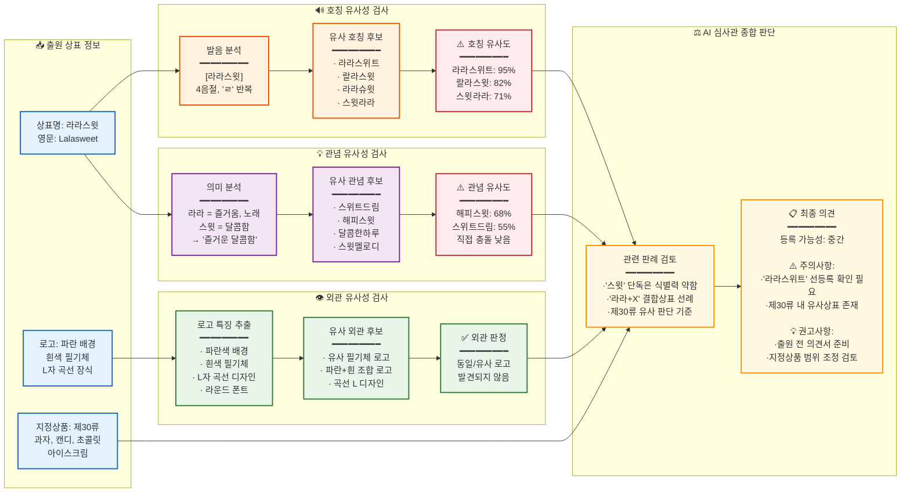
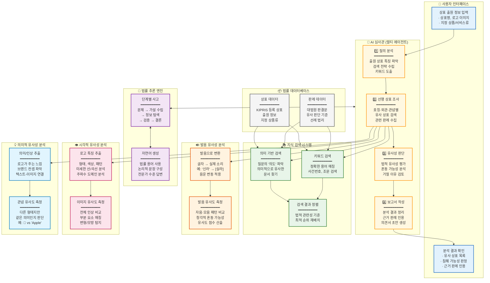
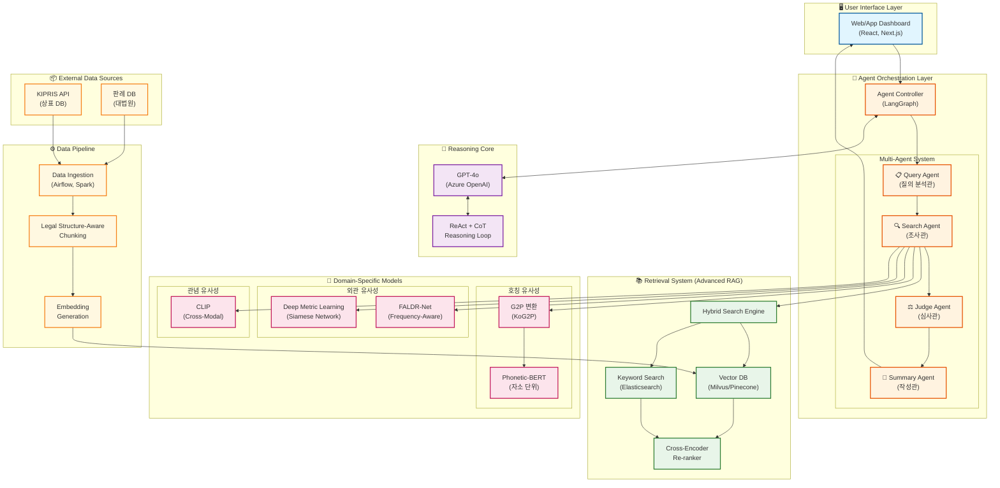

# 🏛️ AI 상표 심사관 (Trademark AI Examiner)

> LLM 기반 차세대 상표 선행 조사 및 침해 분석 시스템 아키텍처

한국 상표법의 **외관(Appearance)**, **호칭(Pronunciation)**, **관념(Conception)** 3요소를 AI로 분석하여 상표 유사성을 판단하는 시스템입니다.

---

## 📋 목차

1. [실제 분석 예시: "라라스윗"](#-실제-분석-예시-라라스윗)
2. [시스템 아키텍처 (개념 중심)](#-시스템-아키텍처-개념-중심)
3. [시스템 아키텍처 (알고리즘 중심)](#-시스템-아키텍처-알고리즘-중심)
4. [핵심 기술](#-핵심-기술)
5. [문서](#-문서)

---

## 🎯 실제 분석 예시: "라라스윗"

**"라라스윗(Lalasweet)"** 상표를 출원한다고 가정했을 때, AI 시스템이 수행하는 분석 흐름입니다.

### 출원 상표

### AI 분석 프로세스

### 분석 결과 요약

| 분석 항목 | 결과 | 비고 |
|:----------|:----:|:-----|
| **호칭 유사성** | ⚠️ 주의 | "라라스위트" 95% 유사 |
| **외관 유사성** | ✅ 안전 | 유사 로고 미발견 |
| **관념 유사성** | ⚠️ 주의 | "해피스윗" 68% 유사 |
| **등록 가능성** | 🟡 중간 | 의견서 준비 권고 |

---

## 🏗️ 시스템 아키텍처 (개념 중심)

> 알고리즘 명칭 대신 **각 컴포넌트가 수행하는 역할**을 쉬운 키워드로 설명합니다.

---

## ⚙️ 시스템 아키텍처 (알고리즘 중심)

> 개발자를 위한 기술 스택 중심의 아키텍처입니다.

---

## 🔧 핵심 기술

### 상표 유사성 3요소 분석

| 요소 | 기술 | 설명 |
|:----:|:-----|:-----|
| **🔊 호칭** | G2P + Phonetic-BERT | 한국어 음운 변동을 반영한 발음 유사도 분석 |
| **👁️ 외관** | FALDR-Net + CLIP | 로고의 형태/색상/패턴 특징 기반 시각적 유사도 |
| **💡 관념** | CLIP + LLM | 브랜드가 주는 의미/인상의 유사성 판단 |

### RAG vs Fine-tuning

본 시스템은 **RAG (Retrieval-Augmented Generation)** 아키텍처를 채택합니다.

| 항목 | Fine-tuning | RAG (본 시스템) |
|:-----|:----------:|:---------------:|
| 지식 최신성 | ❌ 학습 시점 고정 | ✅ 실시간 업데이트 |
| 환각 위험 | ⚠️ 17~33% | ✅ 근거 기반 생성 |
| 설명 가능성 | ❌ 블랙박스 | ✅ 참조 문서 명시 |
| 비용 | 💰 GPU 학습 비용 | 💵 API 호출 비용 |

---

## 📚 문서

- [심층 연구 보고서](2026-01-09_deep_research.md) - 전체 기술 아키텍처 및 SOTA 연구 분석

---

## 📄 License

MIT License
